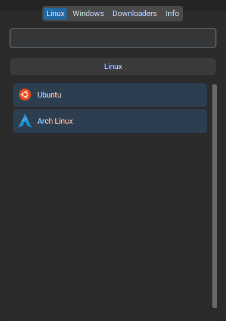
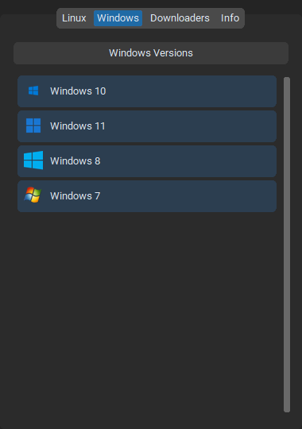
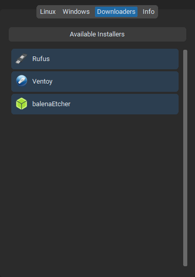
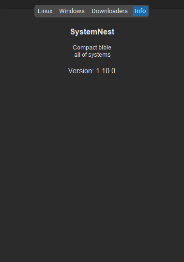

# 🛡️ SystemNest

**SystemNest** is a modern desktop application—a compact "bible" of operating systems and useful software. It is a convenient navigator through the world of Linux distributions, Windows versions, and essential downloaders, built for those who value speed and order.

---

## 📖 Table of Contents
1. [Overview](#overview)
2. [Key Features](#key-features)
3. [Tech Stack](#tech-stack)
4. [Project Structure](#project-structure)
5. [Installation and Run](#installation-and-run)
6. [Screenshot Gallery](#screenshot-gallery)
7. [Roadmap](#roadmap)

---

## 🌟 Overview

**SystemNest** solves the problem of finding clean, up-to-date OS images. Instead of keeping hundreds of bookmarks in a browser, you use a single control center. The app lets you not only view a list of available systems but also read their descriptions, view banners, and download the desired version in one click.

---

## ✨ Key Features

* **🗂️ Three-layer architecture:** Content is separated into **Linux**, **Windows**, and **Downloaders**.
* **🔍 Live search:** Instant filtering of distributions by name as you type.
* **🖼️ Detail cards:** On click, the app dynamically restructures the UI to show:
    * Full-size system banner.
    * Detailed text description.
    * Quick download button.
    * List of additional editions (for example, different kernel or shell versions).
* **🎨 Modern UI:** Fully dark theme built on `CustomTkinter` with smooth animations and adaptive icons.
* **💾 JSON-Driven:** All app content is managed by external files. You can update the list of systems without touching the source code.

---

## 🛠 Tech Stack

The project is written in **Python 3.13.7** using the following libraries:
* `CustomTkinter` — high-level graphical interface.
* `Pillow (PIL)` — advanced image processing and scaling.
* `Webbrowser` — integration with the system browser.
* `JSON` — lightweight data storage format.

---

## 📂 Project Structure

```text
SystemNest/
├── main.py              # Main application file
├── distros.json         # Database of Linux distributions
├── windows.json         # Database of Windows versions
├── downloaders.json     # Database of software/downloaders
├── images/
│   └──                  # App icon
└── logos/               # Folder with logos
    └──  
└── banners/             # Folder with banners
    └──  
├── README.MD            # Introduction
```

## 🚀 Installation and Run

Clone the repository:

```
git clone [https://github.com/miroshantoshan/systemnest.git](https://github.com/your-username/systemnest.git)
cd systemnest-main
```

Install dependencies:

```
pip install customtkinter pillow
```

Run the program:
```
python main.py
```

✅ Done!


## 🖼️ Screenshot Gallery









## ⚙️ Roadmap

You can find plans for upcoming updates, beta releases, detailed changes, and roadmap items in our [channel](https://t.me/systemnest)
